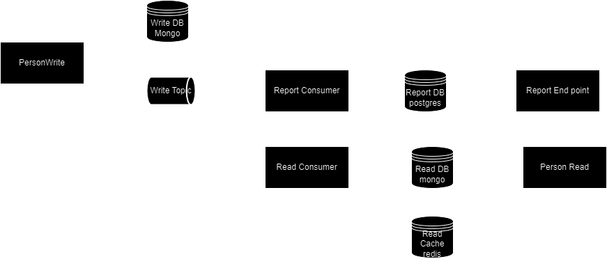

# Experimental SpringBoot App
Example Spring boot app used to learn technologies.
  

### External Dependencies
* jdk22
* Kafka
* rabbitmq
* docker-compose available on command line

### Targeted Tech Stacks
* Springboot mvc
* Springboot reactive
* openapi
* liquibase
* postgres
* mongodb
* docker-compose
* k8s

